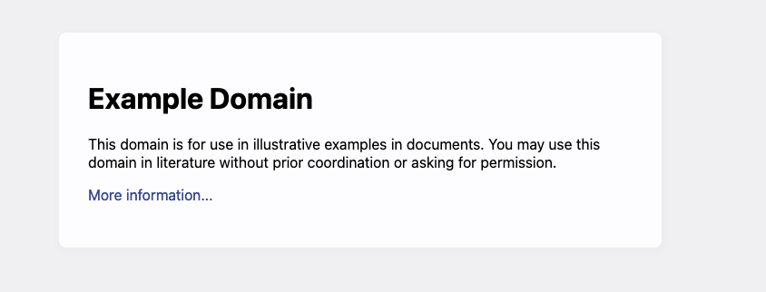
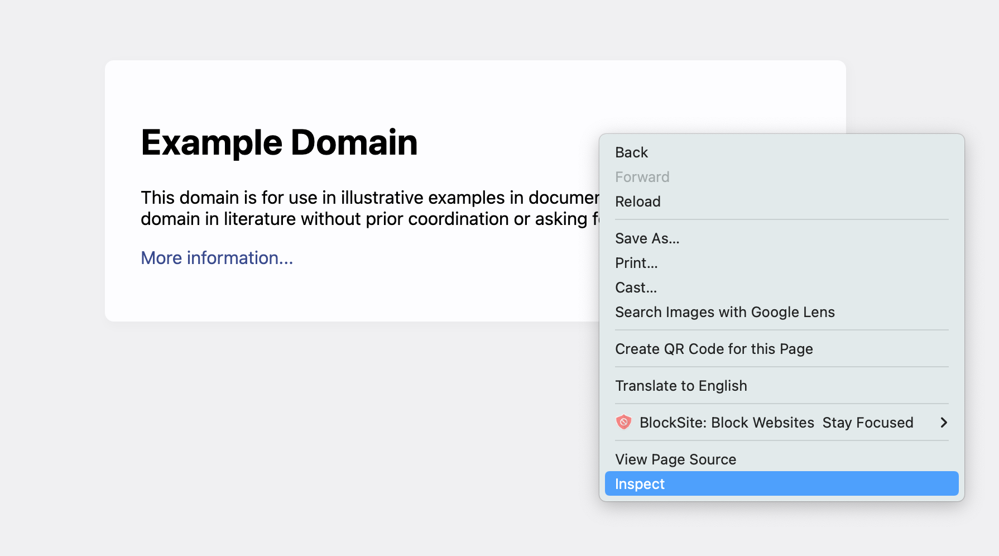
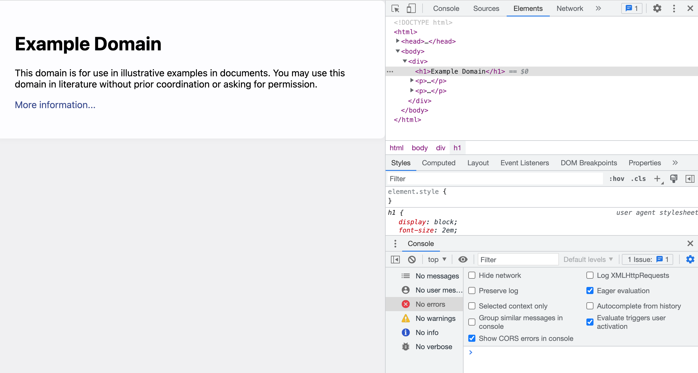
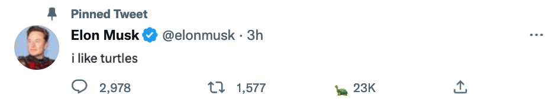

# WEEK 0 - HTML

- [A bootleg introduction to HTML](#a-bootleg-introduction-to-html)
  - [Hey Mozilla Foundation, what's HTML?](#hey-mozilla-foundation-whats-html)
  - [Let's look at an example](#lets-look-at-an-example)
      - [Exhibit 0.1](#exhibit-01)
      - [Exhibit 0.2](#exhibit-02)
      - [Fun Activity 0.1](#fun-activity-01)
      - [Fun Activity 0.2](#fun-activity-02)
  - [HTML is pretty simple](#html-is-pretty-simple)
  - [Some stages in the evolution of web development](#some-stages-in-the-evolution-of-web-development)
- [Homewerk](#homewerk)
  - [MORE??](#more)

## A bootleg introduction to HTML

You will begin your coding journey the same way I did. On Codecademy. It's free. It's fun. It's the best bang for your buck for learning coding stuff. And lessons can be done in itty bitty chunks of time if you need to.

I've assigned you just the HTML course to start (see: [Homewerk](#homewerk)).

Our journey begins with **HTML**, "the building block of the Web":tm:. Once we understand how to build a website with HTML we can then:
- make it pretty with **CSS**
- make it interactive with **JavaScript**
- make it process data from forms with **Python** on the backend
- unify our HTML, CSS, and JavaScript and do it all in **React**
- fire all our developers and switch to a [no-code](https://www.superblocks.com/) solution

### Hey Mozilla Foundation, what's HTML?

> HTML (HyperText Markup Language) is the most basic building block of the Web. It defines the meaning and structure of web content. Other technologies besides HTML are generally used to describe a web page's appearance/presentation (CSS) or functionality/behavior (JavaScript).
>
> "Hypertext" refers to links that connect web pages to one another, either within a single website or between websites. Links are a fundamental aspect of the Web. By uploading content to the Internet and linking it to pages created by other people, you become an active participant in the World Wide Web.
>
>HTML uses "markup" to annotate text, images, and other content for display in a Web browser. HTML markup includes special "elements" such as `<head>, <title>, <body>, <header>, <footer>, <article>, <section>, <p>, <div>, <span>, , <aside>, <audio>, <canvas>, <datalist>, <details>, <embed>, <nav>, <output>, <progress>, <video>, <ul>, <ol>, <li>` and many others.
>
>An HTML element is set off from other text in a document by "tags", which consist of the element name surrounded by "<" and ">". The name of an element inside a tag is case insensitive. That is, it can be written in uppercase, lowercase, or a mixture. For example, the `<title>` tag can be written as `<Title>`, `<TITLE>`, or in any other way. However, the convention and recommended practice is to write tags in lowercase.

*Source: [https://developer.mozilla.org/en-US/docs/Web/HTML](https://developer.mozilla.org/en-US/docs/Web/HTML)*

Cool. Thanks.

### Let's look at an example

When you go to example.com in your internet browser, you are making a backend request to example.com's server. And example.com's server is sending you back HTML code.

That HTML code looks partly like this:

##### Exhibit 0.1
```
<div>
    <h1>Example Domain</h1>
    <p>This domain is for use in illustrative examples in documents. You may use this
    domain in literature without prior coordination or asking for permission.</p>
    <p><a href="https://www.iana.org/domains/example">More information...</a></p>
</div>
```
*Source: [example.com](https://example.com)*

But your internet browser is super smart. So it doesn't just show you that plain text. The browser knows how to render it into something visual.

##### Exhibit 0.2
<p align="left">
  
</p>

But at the end of the day, all that's getting sent to the browser from example.com's server is like a kilobyte of plaintext data.

I know. This is all hard to believe. A website is just like, what, all letters and numbers? Yep, pretty much.

Don't believe me? See for yourself!!!!!

##### Fun Activity 0.1
- [ ] Open up your **Terminal** application
    - I'm not sure if you've used the command line before. If you haven't, you're in for a treat. Get ready to get all Mr. Robot with it.
    - I don't know how Terminal works on Windows. Here, look at this. [https://www.lifewire.com/how-to-open-command-prompt-2618089](https://www.lifewire.com/how-to-open-command-prompt-2618089)
- [ ] type in `curl example.com`
    - (and then press `Enter` on your keyboard)

What you've just done is make a `GET` request to `example.com` - the same thing your internet browser does when you enter `example.com` into the address bar.

In the response on your terminal window, you should be seeing the exact same HTML instructions that your internet browser received.

Isn't that neat! A website is just made up of a bunch of letters and numbers. There are even those who believe in the mystic arts and say that it's all just *1's and 0's* all the way down. Personally, I've never seen it. And I would prefer to keep religious conjecture out of my school.

If you want to see those raw instructions that go into making a website, you can even view them within your browser.

##### Fun Activity 0.2
- [ ] Go to [example.com](https://example.com)
- [ ] Open up the *inspector*.
    - This can also be accomplished by right-clicking on a page and selecting "Inspect."

    <p align="left">
        
    </p>

    - (Or you can learn the [shortcut](https://www.codeleaks.io/shortcut-inspect-element-browsers/) for your browser + operating system of choice.)
- [ ] Behold. More information than you ever wanted to know.
    <p align="left">
        
    </p>

You can even play around with the inspector to change things about your website. This is a tool that every frontend dev uses for testing, experimentation, and spreading misinformation.
<p align="left" style="border:solid;width:fit-content;">
    
</p>

### HTML is pretty simple

Let's look back at our HTML code example from [Exhibit 0.1](#exhibit-01). 
```
<div>
    <h1>Example Domain</h1>
    <p>This domain is for use in illustrative examples in documents. You may use this
    domain in literature without prior coordination or asking for permission.</p>
    <p><a href="https://www.iana.org/domains/example">More information...</a></p>
</div>
```
Even without really knowing any HTML, we can still read it and kinda see what's going on. All the main content is nested inside a `<div>` container. The main title is inside an `<h1>`  header tag. Content is inside `<p>` tags. The Codecademy course will give you a deeper breakdown, but HTML is pretty straightforward when you get the hang of it.

If you look on Codecademy, you will notice that there is no class for "Beginner HTML" or "Intermediate HTML" or "Advanced HTML". It's just "Learn HTML". There's not a whole lot to it compared to Python or CSS or JavaScript. You can get 99% of the working knowledge you need about HTML just from that one class.

So then what's so hard about web development?

The catch is that HTML ([for the most part](https://html.com/html5/#What_is_HTML5)) is totally static. It can't change once it's been loaded on a page. There's no interactivity.

### Some stages in the evolution of web development

So, do you need to learn JavaScript in order to make a web application? Maybe. Probably. But not necessarily. Before jumping into the deep end of a huge React application, let's walk through a progression of some simpler sites to see what benefits JavaScript can bring to the table.

You can certainly make a website using HTML alone, no JavaScript required. Here's an example of a website that drives that point home: [https://motherfuckingwebsite.com/](https://motherfuckingwebsite.com/)

Paul Graham (programmer/venture capitalist/tech influencer extraordinaire) has a [personal website](http://www.paulgraham.com/articles.html) that takes it just a step further. He has some minimal CSS styling and color. There are a couple images. All this can all be accomplished without any JavaScript.

Now go onto [SquareSpace](https://www.squarespace.com/) and start scrolling. Whoa! Look at all those things popping in and out and flying around! So neat! So trendy! Most of that fancy dynamic stuff was accomplished thanks to JavaScript. (Nowadays some of that fancy stuff can be accomplished with advanced HTML5 and CSS3, but in general moving elements and interactivity and calculations are handled by JavaScript.)

But there are other uses for JavaScript that may be more pertinent to your web app needs. Try going to [https://www.airbnb.com](https://www.airbnb.com) and searching for a rental in `Hot Springs, Arkansas`. Pay special attention to each step along the way. There are a ton of tiny micro-interactions that you may not have appreciated before. Things to click, settings to adjust, new DOM elements getting loaded in. This is a serious JavaScript application.

However, your fishing web application may not even need JavaScript. [You can make web forms and display submission results using HTML alone](https://www.w3schools.com/html/html_forms.asp).

A good way to approach software development (and continuing software development education) is to make something as simple as possible and only add on new bells and whistles as needed. There will come a time when using React will be the right fit for your project. And when that time comes, using React will be *easier* than using raw HTML or CSS or JavaScript. That's the secret. It's not about making things more complicated, it's about solving requirements in the easiest possible way. By starting your journey with bare-bones HTML and CSS (and maybe vanilla JavaScript) you'll come to appreciate what a heavier framework like React can offer you. But it's helpful to start here and understand what it is that React would be doing for you under the hood.

## Homewerk

Take as much time as you need. Doing this Codecademy course is pretty much a prerequisite to doing anything else web dev related.

- [ ] Learn HTML
    - [https://www.codecademy.com/learn/learn-html](https://www.codecademy.com/learn/learn-html)
- [ ] Sign up for [github](https://github.com/) (if you haven't already)

### MORE??

The next thing I'm going to have you learn is Python. Probably. If you finish your HTML course before we meet again, you can get started on your next homework assignment.

- [ ] Learn Python 3
    - [https://www.codecademy.com/learn/learn-python-3](https://www.codecademy.com/learn/learn-python-3)

*(FYI, it's not "Learn Python" + "3", it's "Learn" + "Python 3". It's Python v3. As opposed to Python v2. The update from v2 to v3 had major breaking changes in the core Python language a few years ago. Yeah. Let's not worry about that. [https://xkcd.com/1987/](https://xkcd.com/1987/))*

And yeah, you'll be learning Python for backend, not Javascript. Python is where you want to start. It's simpler, it's clearer, it's more transferable. When you understand Python, you'll understand how every other OOL (Object-Oriented Language) works (GO, Java, Python, Ruby, JavaScript, COBOL, etc.).

Alternatively, if you want to continue on the frontend path and learn how to make your website pretty, you can learn CSS. For the sake of time, I'm on the fence about how much I want you to learn this. We can discuss next week.

- [ ] Learn CSS
    - [https://www.codecademy.com/learn/learn-css](https://www.codecademy.com/learn/learn-css)

At some point we'll also fit in an introduction to git.